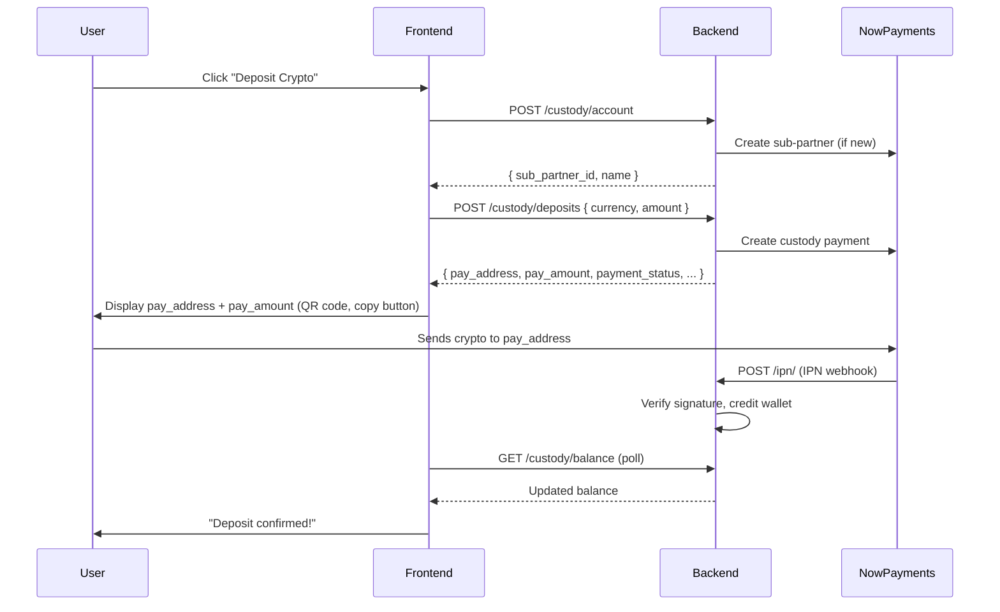

# NowPayments Integration — Frontend Developer Guide

> **Base URL**: `{YOUR_API_BASE}/api/nowpayments`
>
> All authenticated endpoints require a **JWT Bearer token** in the `Authorization` header.

---

## Overview

NowPayments has been integrated as a **crypto custody deposit** system. It allows users to deposit cryptocurrency directly into their CheeseBall wallet via the NowPayments sub-partner (custody) API. The flow is:

1. Frontend creates/fetches the user's custody account
2. Frontend initiates a deposit (specifying crypto currency + amount)
3. Backend returns a **pay address** and **pay amount** — the user sends crypto to that address
4. NowPayments sends an **IPN (webhook)** when the payment is confirmed
5. Backend automatically credits the user's internal wallet balance



---

## Endpoints

### 1. Create / Get Custody Account

Creates the user's NowPayments sub-partner custody account (idempotent — returns existing if already created).

| | |
|---|---|
| **Method** | `POST` |
| **URL** | `/api/nowpayments/custody/account` |
| **Auth** | ✅ JWT Required |

#### Request

No request body needed.

#### Response `200 OK`

```json
{
  "sub_partner_id": "1631380403",
  "name": "cb-a1b2c3d4e5f6..."
}
```

| Field | Type | Description |
|---|---|---|
| `sub_partner_id` | `string` | The NowPayments sub-partner ID for this user |
| `name` | `string` | Internal account name (auto-generated from user ID) |

#### Error Response `400`

```json
{
  "detail": "NOWPayments custody account was not created: {...}"
}
```

---

### 2. Create Custody Deposit

Initiates a new crypto deposit. Returns a blockchain address the user must send funds to.

| | |
|---|---|
| **Method** | `POST` |
| **URL** | `/api/nowpayments/custody/deposits` |
| **Auth** | ✅ JWT Required |

#### Request Body

```json
{
  "currency": "trx",
  "amount": 10.5
}
```

| Field | Type | Required | Description |
|---|---|---|---|
| `currency` | `string` | ✅ | Crypto ticker in **lowercase** (e.g. `"trx"`, `"usdt"`, `"btc"`, `"eth"`, `"sol"`) |
| `amount` | `float` or `string` | ✅ | Amount to deposit (must be > 0) |

#### Response `200 OK`

```json
{
  "id": "a7e3f1c2-...-uuid",
  "sub_partner_id": "1631380403",
  "currency": "trx",
  "amount": "10.50000000",
  "provider_payment_id": "pay-5678",
  "pay_address": "TExampleBlockchainAddress123",
  "pay_amount": "10.50000000",
  "payment_status": "waiting",
  "provider_payload": {
    "payment_id": "pay-5678",
    "pay_address": "TExampleBlockchainAddress123",
    "pay_amount": "10.50000000",
    "payment_status": "waiting"
  }
}
```

| Field | Type | Description |
|---|---|---|
| `id` | `string` (UUID) | Internal deposit record ID |
| `sub_partner_id` | `string` | NowPayments sub-partner ID |
| `currency` | `string` | Crypto currency code |
| `amount` | `string` | Requested deposit amount |
| `provider_payment_id` | `string` | NowPayments payment ID |
| `pay_address` | `string` | ⭐ **Blockchain address** to display to the user |
| `pay_amount` | `string \| null` | ⭐ **Exact amount** the user needs to send |
| `payment_status` | `string` | Current status (see statuses below) |
| `provider_payload` | `object` | Raw NowPayments response (for debugging) |

#### Error Responses

| Status | Body | When |
|---|---|---|
| `400` | `{ "detail": "Deposit amount must be a valid number" }` | Invalid amount |
| `400` | `{ "detail": "Deposit amount must be greater than zero" }` | Amount ≤ 0 |
| `400` | `{ "detail": "NOWPayments custody deposit failed: ..." }` | NowPayments API error |

---

### 3. Get Custody Balance

Returns the user's custody account balance as reported by NowPayments.

| | |
|---|---|
| **Method** | `GET` |
| **URL** | `/api/nowpayments/custody/balance` |
| **Auth** | ✅ JWT Required |

#### Request

No request body or params needed.

#### Response `200 OK`

```json
{
  "account": {
    "sub_partner_id": "1631380403",
    "name": "cb-a1b2c3d4e5f6..."
  },
  "provider_balance": {
    "balances": {
      "trx": { "amount": "10.5" },
      "usdt": { "amount": "0" }
    }
  }
}
```

| Field | Type | Description |
|---|---|---|
| `account` | `object` | The user's custody account info |
| `provider_balance` | `object` | Raw balance object from NowPayments (structure varies by provider) |

---

### 4. IPN Webhook (Backend Only — No Frontend Action Needed)

> [!NOTE]
> This endpoint is called by **NowPayments servers**, not the frontend. It is documented here for completeness.

| | |
|---|---|
| **Method** | `POST` |
| **URL** | `/api/nowpayments/ipn/` |
| **Auth** | ❌ None (signature verified via `x-nowpayments-sig` header) |

When a payment reaches `finished` status, the backend automatically:
1. Verifies the HMAC-SHA512 signature
2. Finds the matching `CustodyDeposit` by `payment_id`
3. Credits the user's internal `WalletBalance` for the matching asset
4. Records a `Ledger` entry (type: `wallet_deposit`)
5. Updates `PlatformReserve` balance
6. Marks the deposit as credited (prevents double-crediting)

---

### 5. Admin Diagnostics (Admin Only)

| | |
|---|---|
| **Method** | `GET` |
| **URL** | `/api/nowpayments/admin/diagnostics` |
| **Auth** | ✅ JWT Required (must be `is_staff`) |

#### Response `200 OK`

```json
{
  "configured": true,
  "status": { "message": "OK" },
  "currencies": { "currencies": ["btc", "eth", "trx", "usdt", ...] },
  "balance": { "btc": { "amount": "0" }, ... }
}
```

#### Error Response `403`

```json
{ "detail": "Admin access required" }
```

---

## Payment Status Values

These are the possible values for `payment_status` on a deposit:

| Status | Meaning | Frontend Action |
|---|---|---|
| `waiting` | Payment created, awaiting user's crypto transfer | Show pay address + amount, prompt user to send |
| `confirming` | Transaction detected on blockchain, waiting for confirmations | Show "Confirming..." spinner |
| `confirmed` | Transaction confirmed but not yet fully processed | Show "Processing..." |
| `sending` | NowPayments is processing the funds | Show "Processing..." |
| `partially_paid` | User sent less than required amount | Show warning, suggest sending remainder |
| `finished` | ✅ Payment complete — wallet has been credited | Show success, update balance |
| `failed` | Payment failed | Show error state |
| `refunded` | Payment was refunded | Show refund notice |
| `expired` | Payment address expired before user sent funds | Prompt user to create a new deposit |

---

## Recommended Frontend Flow

### Step 1: Deposit Page UI

When the user navigates to "Deposit Crypto":

```
1. Call POST /api/nowpayments/custody/account
   → Ensures the user has a custody account (call once, cache the result)

2. Show a form with:
   - Currency selector (dropdown: BTC, ETH, USDT, TRX, SOL, etc.)
   - Amount input field
   - "Generate Deposit Address" button
```

### Step 2: Generate Deposit

```
3. On button click → POST /api/nowpayments/custody/deposits
   Body: { "currency": "trx", "amount": 10.5 }

4. Display the response:
   - pay_address → Show as text + QR code + Copy button
   - pay_amount  → Show the exact amount to send
   - payment_status → Show current status badge
```

### Step 3: Waiting for Payment

```
5. Poll GET /api/nowpayments/custody/balance every 15-30 seconds
   OR poll GET /api/wallets/ (the existing wallet balance endpoint)
   to detect when the internal balance updates.

6. When balance increases → Show "Deposit confirmed!" toast/notification
```

> [!TIP]
> The internal wallet balance (`/api/wallets/`) is the source of truth for the user's actual spendable balance. The NowPayments custody balance (`/custody/balance`) reflects what NowPayments holds — use it only for debugging or showing the provider-side state.

---

## What Happens Behind the Scenes (IPN Credit Flow)

When the user sends crypto to the `pay_address`:

```
NowPayments detects the payment on-chain
    ↓
NowPayments sends IPN to POST /api/nowpayments/ipn/
    ↓
Backend verifies HMAC-SHA512 signature (x-nowpayments-sig header)
    ↓
Backend finds matching CustodyDeposit by provider_payment_id
    ↓
If payment_status = "finished":
    ├── Credits user's WalletBalance (e.g., USDT +1.20)
    ├── Records Ledger entry (wallet_deposit)
    ├── Updates PlatformReserve (+1.20)
    └── Marks deposit.credited_at (prevents double-credit)
```

> [!IMPORTANT]
> The user's wallet balance is only updated when NowPayments confirms the payment is `finished`. The frontend should **not** show the deposit as credited until the wallet balance endpoint reflects the new amount.

---

## Authentication

All authenticated endpoints use the same JWT auth as the rest of the CheeseBall API:

```
Authorization: Bearer <access_token>
```

Obtain tokens from:
- `POST /api/auth/token/pair` → `{ access, refresh }`
- `POST /api/auth/token/refresh` → `{ access }`

---

## Supported Currencies

The currencies supported depend on NowPayments' available coins. Common ones:

| Ticker | Name |
|---|---|
| `btc` | Bitcoin |
| `eth` | Ethereum |
| `usdt` | Tether (USDT) |
| `trx` | Tron |
| `sol` | Solana |
| `bnb` | Binance Coin |
| `matic` | Polygon |
| `ltc` | Litecoin |

> [!NOTE]
> Currency values should be sent in **lowercase** in the request body (e.g., `"trx"`, not `"TRX"`). The backend normalizes to lowercase automatically.

---

## Summary of New Endpoints

| Method | Endpoint | Auth | Purpose |
|---|---|---|---|
| `POST` | `/api/nowpayments/custody/account` | JWT | Create/get user's custody account |
| `POST` | `/api/nowpayments/custody/deposits` | JWT | Initiate a crypto deposit |
| `GET` | `/api/nowpayments/custody/balance` | JWT | Check custody provider balance |
| `POST` | `/api/nowpayments/ipn/` | None (sig) | IPN webhook (NowPayments → Backend) |
| `GET` | `/api/nowpayments/admin/diagnostics` | JWT (admin) | Health check / debug |

---

## Database Models Created

For context, here are the two new models added to the `nowpayments` Django app:

### CustodyAccount
- One per user (OneToOne relationship)
- Stores the NowPayments `sub_partner_id`
- Created automatically on first call to `/custody/account`

### CustodyDeposit
- One per deposit request
- Tracks: currency, amount, pay_address, payment_status
- `credited_at` field prevents double-crediting on duplicate IPNs

---

## Files Changed in This Integration

| File | What Was Done |
|---|---|
| `backend/nowpayments/__init__.py` | New Django app init |
| `backend/nowpayments/apps.py` | App config |
| `backend/nowpayments/models.py` | `CustodyAccount` and `CustodyDeposit` models |
| `backend/nowpayments/schemas.py` | Request/response Ninja schemas |
| `backend/nowpayments/services.py` | All business logic: NowPayments API calls, IPN verification, wallet crediting |
| `backend/nowpayments/views.py` | View functions for each endpoint |
| `backend/nowpayments/router.py` | Django-Ninja router with 5 endpoints |
| `backend/nowpayments/tests.py` | Unit tests covering IPN, deposits, diagnostics |
| `backend/engine/api.py` | Mounted the nowpayments router at `/api/nowpayments` |
| `backend/engine/settings.py` | Added 6 `NOWPAYMENTS_*` settings (env vars) |
| `backend/.env` | Added `NOWPAYMENTS_API_KEY`, `NOWPAYMENTS_IPN_SECRET`, `NOWPAYMENTS_WEBHOOK_URL` |
